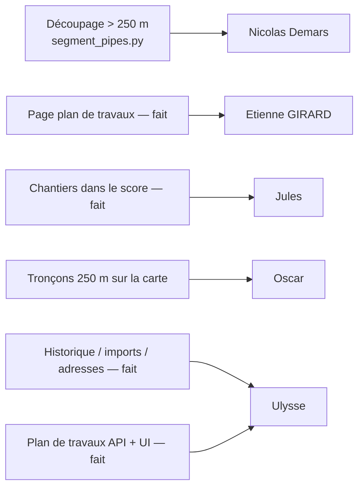

# RenovTaCana · **version V2.2**

Prototype hébergé en ligne : **https://k2vm-163.mde.epf.fr**

Projet **RenovTaCana** (Eau d’Azur). Cette branche correspond à la **V2.2**, version livrée pour l’avant-dernier sprint.

L’objectif principal de cette version est l’**édition d’un plan de travaux**, en s’appuyant sur le **score de priorité** calculé lors du sprint précédent.

---

## Lancer l’app

Sous **Windows** : exécuter **`segment_pipes.py`** puis **`convert_epsg2154_to_epsg4326.py`**. Ce programme crée la table des canalisations segmentées. On peut ensuite lancer l'app.

Sous **Windows** : exécuter **`demarrer-web-app.bat`** (double-clic, ou `.\demarrer-web-app.bat` dans PowerShell). Ce script lance **uvicorn** sur **`http://127.0.0.1:8000`** et ouvre le navigateur. **Il n’est utilisable que sous Windows** (fichier `.bat`).

Autres OS ou lancement manuel : à la racine du dépôt,

```bash
python -m uvicorn script.main:app --reload
```

Puis ouvrir **`http://127.0.0.1:8000/`** dans le navigateur. La base d’URL API est gérée dans **`js/config.js`**.

> En PowerShell, enchaîner les commandes avec **`;`** plutôt qu’avec `&&` (non supporté sur les anciennes versions).

---

## Pages de l’application

| Page | Fichier | Rôle |
|------|---------|------|
| Résultats adresses | `index.html` | Tableau des canalisations par adresse, filtres, export CSV, mini-carte, détail canalisation |
| Carte interactive | `carte.html` | Heatmap Leaflet, sélection, ajout au plan de travaux |
| Plan de travaux | `plan-travaux.html` | Édition, sauvegarde et gestion des plans en base |
| Tableau de bord | `dashboard.html` | Indicateurs clés |
| Base de données | `database.html` | Imports métier, score de priorité, historique, rollback |

---

## Fonctionnalités (V2.2)

### Carte, adresses et données

- **Carte interactive** (Leaflet) : canalisations, chantiers, couches géographiques, sélection rectangulaire.
- **Tableau d’adresses** (`index.html`) : recherche, filtres, pagination serveur, export CSV, **mini-carte** avec localisation d’une canalisation.
- **Modale de détail** partagée : toutes les infos canalisation / conduite (API + source enrichie), sur `index.html` et `plan-travaux.html`.
- **Tableau de bord** et **page base de données** (imports xlsx/csv, historique, rollback).
- **API FastAPI** : canalisations, chantiers, opérations, adresses, stats, filtres, GeoJSON.
- **Score de priorité** : `script/priority_score.py`, `POST /api/database/compute-priority` (80 % criticité + bonus chantier / opération).
- **Recherche** : barre avec suggestions via l’API.

### Plan de travaux (`plan-travaux.html`)

- **Plan courant** en mémoire locale : ajout depuis la carte, réordonnancement, inclusion / exclusion de lignes (cochées).
- **Sauvegarde en base** : nom, budget, tarif €/ml, note, date de dernière enregistrement.
- **Liste des plans** sauvegardés : chargement, duplication, suppression, indicateur budget (dans le budget / dépassement).
- **Tarification** : coût estimé par ligne et total selon le tarif au mètre linéaire.
- **Export CSV** des lignes cochées (`[nom-du-plan]-[date].csv`).
- **Actions par ligne** : voir le détail (modale), afficher le tracé sur une **mini-carte en modale**, supprimer, monter / descendre.
- **Tronçons synthétiques** : prise en charge des identifiants du type `CAN-xxx (1/2)` (lien avec la canalisation d’origine).
- **Badge** sur la navigation : nombre de canalisations dans le plan courant (toutes les pages).
- **Fermeture du plan** : avertissement si modifications non sauvegardées.

---

## En cours / à venir

| Fonctionnalité | Statut | Cible |
|----------------|--------|--------|
| Page plan de travaux | **Fait** | V2.2 |
| Prise en compte des chantiers dans le score | **Fait** | V2.2 |
| Historique et mise à jour de la base | **Fait** | V2.2 |
| Mise à jour adresses chantiers / opérations | **Fait** | V2.2 |
| Découpage canalisations > 250 m (`segmentation`) | Script prêt | V2.2+ |
| Affichage des tronçons 250 m sur la carte | À venir | V2.2+ |
| Route API GeoJSON segmentation | À venir | V2.2+ |

---

## Documentation technique

- **[Gestion de la base de données](doc/gestion-base-donnees.md)** — imports métier, score de priorité, historique, rollback.
- **[Score de priorité](doc/score-priorite.md)** — formule, poids, calcul et usage dans l’app.
- **[Segmentation des canalisations](doc/segmentation.md)** — tronçons 250 m, table `segmentation`, scripts `row-data`.
- **[MCD](database/MCD.md)** — modèle conceptuel SQLite (dont plans de travaux).

---

## Arborescence (principaux fichiers)

```
.
├── demarrer-web-app.bat        ← Lancement Windows
├── requirements.txt
├── database.py                 ← Connexion SQLite (get_db)
├── README.md
│
├── index.html                  ← Résultats adresses
├── carte.html                  ← Carte interactive
├── plan-travaux.html           ← Plan de travaux
├── dashboard.html
├── database.html
│
├── script/
│   ├── main.py                 ← FastAPI (uvicorn script.main:app)
│   ├── priority_score.py
│   ├── endpoints/
│   │   ├── canalisations.py
│   │   ├── chantiers.py
│   │   ├── operations.py
│   │   ├── stats.py
│   │   ├── dashboard.py
│   │   ├── filtres.py
│   │   ├── geojson.py          ← GeoJSON global + /{facilityid}
│   │   ├── plans_travaux.py    ← CRUD plans de travaux
│   │   └── database/           ← imports, rollback, compute-priority
│   └── database/
│       ├── build-sqlite/       ← build_sqlite_database.py → renovTaCana.db
│       └── row-data/           ← segment_pipes.py, conversions EPSG, …
│
├── css/
│   ├── style.css
│   ├── detail-modal.css        ← Modale détail canalisation (partagée)
│   ├── adresses.css            ← index.html
│   ├── carte.css
│   ├── dashboard.css
│   ├── plan-travaux.css
│   └── database.css
│
├── js/
│   ├── config.js               ← __RTC_API_BASE__
│   ├── theme.js
│   ├── search.js
│   ├── index.js
│   ├── carte.js
│   ├── dashboard.js
│   ├── plan-travaux.js         ← Logique plan (+ partagé avec carte.html)
│   ├── plan-nav-badge.js       ← Compteur plan sur la navigation
│   ├── plan-canal-map-modal.js ← Mini-carte modale (plan de travaux)
│   ├── canalisation-detail-modal.js
│   ├── mini-map.js             ← Mini-carte sidebar (index.html)
│   └── database.js
│
├── doc/                        ← Documentation métier / technique
├── data/                       ← Données sources brutes
└── database/
    ├── renovTaCana.db
    ├── MCD.md
    └── outdated/               ← Archives des anciennes bases
```

---

## Répartition des tâches (sprint V2.2)



---
