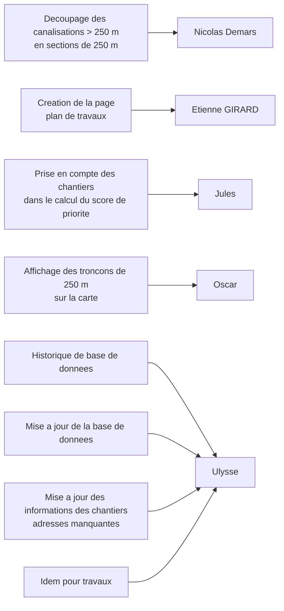

# RenovTaCana · **version V2.2**

Prototype hébergé en ligne : **https://k2vm-163.mde.epf.fr**

Projet **RenovTaCana** (Eau d’Azur). Cette branche correspond a la **V2.2**, version qui sera delivree pour l'avant-dernier sprint.
L'objectif principal est l'**edition d'un plan de travaux**, en s'appuyant sur le **score de priorite** calcule lors du sprint precedent.

---

## Etat des fonctionnalites (V2.2)

### Fonctionnel

- **Carte interactive** (heatmap / Leaflet) : affichage des canalisations, chantiers et couches geographiques.
- **Tableau d'adresses** (`index.html`) : parcours, recherche, filtres et export des adresses.
- **Tableau de bord** (`dashboard.html`) : visualisation des indicateurs cles.
- **API FastAPI** : endpoints complets (canalisations, chantiers, opérations, adresses, etc.).
- **Mini-map** sur la page adresses.
- **Calcul du score de priorite** : le script de calcul est operationnel et applique les poids definis avec le client.
- **Score de priorite pris en compte** dans l'edition du plan de travaux (base de la priorisation des interventions).
- **Recherche / suggestions** : barre de recherche avec auto-completion via l'API.

### En cours / a venir

| Fonctionnalite | Statut | Cible |
|---|---|---|
| Page "plan de travaux" | En cours | **V2.2** |
| Decoupage des canalisations > 250 m en troncons de 250 m | En cours | **V2.2** |
| Affichage des troncons de 250 m sur la carte | En cours | **V2.2** |
| Prise en compte des chantiers dans le calcul du score de priorite | En cours | **V2.2** |
| Historique et mise a jour de la base de donnees | En cours | **V2.2** |
| Mise a jour des informations des chantiers (adresses manquantes), idem pour travaux | En cours | **V2.2** |

---

## Arborescence 

```
.
├── script/
│   ├── main.py                 ← Point d’entrée FastAPI (`uvicorn script.main:app`)
│   ├── utils.py
│   ├── router/
│   └── database/
│       ├── build-sqlite/
│       │   └── build_sqlite_database.py  ← Génère `database/renovTaCana.db`
│       └── row-data/                      ← Scripts d’exploration des données brutes
├── requirements.txt
├── README.md
├── demarrer-web-app.bat        ← Lancement Windows (voir « Lancer l’app »)
│
├── index.html                  ← Hub résultats / adresses (liens vers carte & dashboard)
├── carte.html                  ← Carte interactive (heatmap / Leaflet)
├── dashboard.html              ← Tableau de bord
│
├── css/
│   ├── style.css               ← Styles communs
│   ├── adresses.css            ← index.html (parcours adresses)
│   ├── carte.css               ← carte.html
│   └── dashboard.css           ← dashboard.html
│
├── js/
│   ├── config.js               ← Base d’URL API / `__RTC_API_BASE__`
│   ├── search.js               ← Barre de recherche / suggestions API
│   ├── index.js                ← Logique page index (paramètres URL, export, etc.)
│   ├── carte.js
│   ├── dashboard.js
│   ├── mini-map.js
│   └── theme.js
│
├── assets/
│   ├── images/                 ← logos, visuels (ex. logo_entreprise.png)
│   └── data/                   ← Assets front legacy (anciens GeoJSON statiques)
│
├── data/                       ← Données sources brutes (xlsx/csv/shp)
│   └── data.zip                ← Archive versionnée à extraire localement
│
└── database/
    ├── renovTaCana.db          ← Base SQLite active utilisée par l’API
    ├── outdated/               ← Archives auto des anciennes bases
    └── MCD.md                  ← MCD de la base active
```

---

## Lancer l’app

Sous **Windows** : exécuter **`demarrer-web-app.bat`** (double-clic, ou `.\demarrer-web-app.bat` dans PowerShell). Ce script lance **uvicorn** sur **`http://127.0.0.1:8000`** et ouvre le navigateur. **Il n’est utilisable que sous Windows** (fichier `.bat`).

Autres OS ou lancement manuel : à la racine du dépôt, `python -m uvicorn script.main:app --reload`. Puis ouvrir **`http://127.0.0.1:8000/`** dans le navigateur. La base d’URL API est gérée dans **`js/config.js`**.

## Prochaines etapes (V2.2)

- **Livrer la page "plan de travaux"** pour l'avant-dernier sprint.
- **Garantir l'utilisation du score de priorite** dans la priorisation des interventions.
- **Finaliser l'integration donnees/metier** (chantiers, travaux, historique de base).

## Repartition des taches (V2.2)



---
