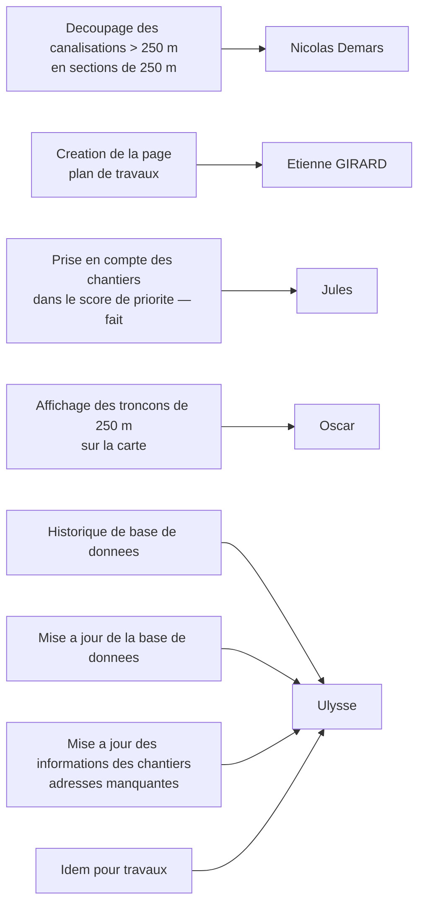

# RenovTaCana · **version V2.2**

Prototype hébergé en ligne : **https://k2vm-163.mde.epf.fr**

Projet **RenovTaCana** (Eau d’Azur). Cette branche correspond a la **V2.2**, version qui sera delivree pour l'avant-dernier sprint.
L'objectif principal est l'**edition d'un plan de travaux**, en s'appuyant sur le **score de priorite** calcule lors du sprint precedent.

---

## Lancer l’app

Sous **Windows** : exécuter **`demarrer-web-app.bat`** (double-clic, ou `.\demarrer-web-app.bat` dans PowerShell). Ce script lance **uvicorn** sur **`http://127.0.0.1:8000`** et ouvre le navigateur. **Il n’est utilisable que sous Windows** (fichier `.bat`).

Autres OS ou lancement manuel : à la racine du dépôt, `python -m uvicorn script.main:app --reload`. Puis ouvrir **`http://127.0.0.1:8000/`** dans le navigateur. La base d’URL API est gérée dans **`js/config.js`**.

---

## En cours / a venir

| Fonctionnalite | Statut | Cible |
|---|---|---|
| Page "plan de travaux" | En cours | **V2.2** |
| Decoupage des canalisations > 250 m en troncons de 250 m | En cours | **V2.2** |
| Affichage des troncons de 250 m sur la carte | En cours | **V2.2** |
| Prise en compte des chantiers dans le calcul du score de priorite | Fait | **V2.2** |
| Historique et mise a jour de la base de donnees | Fait | **V2.2** |
| Mise a jour des informations des chantiers (adresses manquantes) | Fait | **V2.2** |
| Mise a jour des informations des operations (adresses manquantes) | Fait | **V2.2** |

---

## Etat des fonctionnalites (V2.2)

### Fonctionnel

- **Carte interactive** (heatmap / Leaflet) : affichage des canalisations, chantiers et couches geographiques.
- **Tableau d'adresses** (`index.html`) : parcours, recherche, filtres et export des adresses.
- **Tableau de bord** (`dashboard.html`) : visualisation des indicateurs cles.
- **Page base de donnees** (`database.html`) : import des fichiers source (xlsx/csv), historique des versions, rollback.
- **API FastAPI** : endpoints complets (canalisations, chantiers, opérations, adresses, etc.).
- **Mini-map** sur la page adresses.
- **Calcul du score de priorite** : le script de calcul est operationnel et applique les poids definis avec le client (`script/priority_score.py`, `POST /api/database/compute-priority`).
- **Prise en compte des chantiers et operations** dans le score (bonus selon chantier actif et operation recente sur l'adresse).
- **Score de priorite pris en compte** dans l'edition du plan de travaux (base de la priorisation des interventions).
- **Recherche / suggestions** : barre de recherche avec auto-completion via l'API.

---

## Documentation technique

- **[Gestion de la base de données](doc/gestion-base-donnees.md)** — rôle de la page d’administration : imports métier, score de priorité, historique et retour arrière.
- **[Score de priorité](doc/score-priorite.md)** — formule, poids (80 % criticité + bonus chantier / opération), calcul et usage dans l’app.
- **[Segmentation des canalisations](doc/segmentation.md)** — documentation relative à la segmentation des canalisations de plus de 250 m.

## Prochaines etapes (V2.2)

- **Livrer la page "plan de travaux"** pour l'avant-dernier sprint.
- **Afficher les troncons de 250 m** sur la carte et dans le plan de travaux.
- **Finaliser le decoupage** des canalisations > 250 m (table `segmentation`).

## Repartition des taches (V2.2)



---

## Arborescence

```
.
├── .gitignore
├── database.py                 ← Connexion SQLite (`get_db`)
├── requirements.txt
├── README.md
├── demarrer-web-app.bat        ← Lancement Windows (voir « Lancer l’app »)
│
├── index.html                  ← Hub resultats / adresses
├── carte.html                  ← Carte interactive (heatmap / Leaflet)
├── dashboard.html              ← Tableau de bord
├── plan-travaux.html           ← Page plan de travaux
├── database.html               ← Gestion des imports et de l’historique de la base
│
├── script/
│   ├── main.py                 ← Point d’entrée FastAPI (`uvicorn script.main:app`)
│   ├── utils.py
│   ├── priority_score.py       ← Expression SQL du score (criticité + bonus chantier / opération)
│   ├── endpoints/
│   │   ├── canalisations.py    ← `/api/canalisations`, détail, zone, suggestions adresses
│   │   ├── chantiers.py        ← `/api/chantiers`, `/api/chantiers/adresse`
│   │   ├── operations.py       ← `/api/operations`, `/api/operations/adresse`
│   │   ├── stats.py            ← `/api/stats`, `/api/stats/adresse`
│   │   ├── dashboard.py        ← `/api/dashboard`, `/api/plan-travaux`
│   │   ├── filtres.py          ← `/api/filtres`
│   │   ├── geojson.py          ← `/api/geojson/chantiers`, `/api/geojson/canalisations`
│   │   ├── database/
│   │   │   ├── compute_priority.py    ← `POST /api/database/compute-priority`
│   │   │   ├── database_versions.py   ← versions / compteurs base
│   │   │   ├── rollback.py            ← `/api/database/rollback`
│   │   │   ├── import_chantiers.py
│   │   │   ├── import_operations.py
│   │   │   └── import_pipe_ranking.py
│   │   └── __init__.py
│   └── database/
│       ├── build-sqlite/
│       │   ├── build_sqlite_database.py  ← Genere `database/renovTaCana.db`
│       │   ├── nominatim_geocode.py
│       │   └── …
│       └── row-data/
│           ├── segment_pipes.py          ← Segmentation 250 m → table `segmentation`
│           ├── convert_epsg2154_to_epsg4326.py
│           └── …                         ← Scripts d’exploration des donnees brutes
│
├── css/
│   ├── style.css
│   ├── adresses.css            ← index.html
│   ├── carte.css
│   ├── dashboard.css
│   ├── plan-travaux.css
│   └── database.css
│
├── js/
│   ├── config.js               ← Base d’URL API (`__RTC_API_BASE__`)
│   ├── search.js
│   ├── index.js
│   ├── carte.js
│   ├── dashboard.js
│   ├── plan-travaux.js
│   ├── mini-map.js             ← Mini heatmap (index.html)
│   ├── database.js
│   └── theme.js
│
├── assets/
│   └── images/                 ← logos (ex. logo_entreprise.png)
│
├── data/                       ← Données sources brutes (xlsx/csv/shp)
│   ├── data.zip
│   └── README.md
│
├── doc/
│   ├── gestion-base-donnees.md ← Page database.html (imports, rollback, archives)
│   ├── score-priorite.md       ← Calcul du score de priorité (poids, bonus, API)
│   └── segmentation.md         ← Segmentation 250 m, conversion EPSG (scripts row-data)
│
└── database/
    ├── renovTaCana.db          ← Base SQLite active
    ├── outdated/               ← Archives des anciennes bases
    ├── geocode_cache.json
    ├── MCD.md
    └── chantiers.md
```

---
