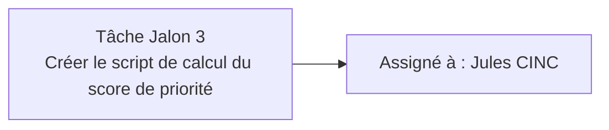

# RenovTaCana · **version V2.0**

Prototype hébergé en ligne : **https://k2vm-163.mde.epf.fr/pages/index.html**

Projet **RenovTaCana** (Eau d’Azur). Cette branche correspond à la **V2.0** : relier les fonctionnalités (carte, tableau d’adresses, tableau de bord, API) dans des **pages utilisables** et une navigation cohérente.

---

## Arborescence 

```
.
├── script/
│   ├── main.py                 ← Point d’entrée FastAPI (`uvicorn script.main:app`)
│   ├── utils.py
│   ├── router/
│   └── database/
│       ├── build-sqlite/
│       │   └── build_sqlite_database.py  ← Génère `database/renovTaCana.db`
│       └── row-data/                      ← Scripts d’exploration des données brutes
├── requirements.txt
├── README.md
├── demarrer-web-app.bat        ← Lancement Windows (voir « Lancer l’app »)
│
├── index.html                  ← Hub résultats / adresses (liens vers carte & dashboard)
├── carte.html                  ← Carte interactive (heatmap / Leaflet)
├── dashboard.html              ← Tableau de bord
│
├── css/
│   ├── style.css               ← Styles communs
│   ├── adresses.css            ← index.html (parcours adresses)
│   ├── carte.css               ← carte.html
│   └── dashboard.css           ← dashboard.html
│
├── js/
│   ├── config.js               ← Base d’URL API / `__RTC_API_BASE__`
│   ├── search.js               ← Barre de recherche / suggestions API
│   ├── index.js                ← Logique page index (paramètres URL, export, etc.)
│   ├── carte.js
│   ├── dashboard.js
│   ├── mini-map.js
│   └── theme.js
│
├── assets/
│   ├── images/                 ← logos, visuels (ex. logo_entreprise.png)
│   └── data/                   ← Assets front legacy (anciens GeoJSON statiques)
│
├── data/                       ← Données sources brutes (xlsx/csv/shp)
│   └── data.zip                ← Archive versionnée à extraire localement
│
└── database/
    ├── renovTaCana.db          ← Base SQLite active utilisée par l’API
    ├── outdated/               ← Archives auto des anciennes bases
    └── MCD.md                  ← MCD de la base active
```

---

## Lancer l’app

Sous **Windows** : exécuter **`demarrer-web-app.bat`** (double-clic, ou `.\demarrer-web-app.bat` dans PowerShell). Ce script lance **uvicorn** sur **`http://127.0.0.1:8000`** et ouvre le navigateur. **Il n’est utilisable que sous Windows** (fichier `.bat`).

Autres OS ou lancement manuel : à la racine du dépôt, `python -m uvicorn script.main:app --reload`. Puis ouvrir **`http://127.0.0.1:8000/`** dans le navigateur. La base d’URL API est gérée dans **`js/config.js`**.

## Prochaines étapes indispensables (Jalon 3)

- Créer le script qui calcule le **score de priorité** pour chaque canalisation, puis renseigne `canalisations.score_priorite` dans `database/renovTaCana.db`.

## Association des tâches



---
