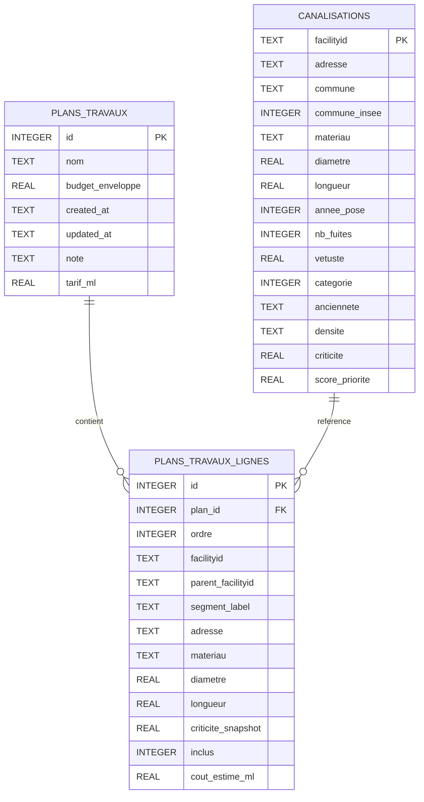

# MCD - Base `renovTaCana.db` (schema produit par le build SQLite)

Ce document decrit le **modele de donnees cible** de `database/renovTaCana.db` tel qu'il est **cree et rempli** par le script Python :

`script/database/build-sqlite/build_sqlite_database.py`

(avec `script/database/build-sqlite/geo_communes_import.py` pour `communes` et `script/database/build-sqlite/nominatim_geocode.py` pour les coordonnees chantiers.)

Un fichier `renovTaCana.db` present dans le depot sans regeneration peut **differer** de ce schema (colonnes manquantes ou donnees obsoletes) ; le script ci-dessus reste la reference.

## Vue d'ensemble

Tables metier **referentiel** creees par le build :

- `conduites`
- `canalisations`
- `chantiers`
- `operations`
- `communes`

Tables **applicatives** (saisie utilisateur — plans de travaux figes) :

- `plans_travaux` — en-tete du plan (nom, budget, dates)
- `plans_travaux_lignes` — une ligne par canalisation (ou troncon) dans un plan

Ces tables sont **creees** par `build_sqlite_database.py` (`ensure_plans_travaux_schema`) en fin de build. Lors d'un rebuild, les plans existants sont **repristines** depuis la base archivee (`database/outdated/`) si les tables etaient deja presentes.

(La table interne `sqlite_sequence` peut exister pour les autoincrements SQLite ; elle n'est pas modelisee ici.)

## Diagrammes MCD (Mermaid)

Les diagrammes ci-dessous listent **toutes les colonnes** de chaque table (types SQLite du build). Source : `script/database/build-sqlite/build_sqlite_database.py`. Les colonnes `operations.id1_source` et `operations.projet_titre` sont ajoutees par import Excel si absentes du build initial (`ALTER TABLE`).

### Referentiel reseau (build)

```mermaid
erDiagram
    CONDUITES {
        TEXT FACILITYID PK
        INTEGER abandoned
        REAL longueur
        TEXT COMMUNE
        TEXT INSEE
        TEXT UDI
        TEXT NUM_OP
        INTEGER OBJECTID
        REAL DIAMETER
        REAL DIAMEXT
        TEXT PRECISIOND
        TEXT MATERIAL
        TEXT PRECISIONM
        TEXT INSTALLDAT
        TEXT PRECISIONI
        TEXT PERIODE_PO
        TEXT WATERTYPE
        TEXT DOMAINE
        TEXT FONCTION
        TEXT SENSIBILIT
        TEXT PRESSION
        TEXT OSSATURE
        TEXT CONTRAT
        TEXT ADRESSE
        REAL COTE_TN
        REAL PROFONDEUR
        TEXT JOINT
        TEXT EMPLACEMEN
        TEXT LITDEPOSE
        TEXT TYPE_SOL
        TEXT ETAT_SOL
        TEXT TRAFIC
        TEXT ENVIR_ELEC
        INTEGER NB_BRANCHE
        TEXT FABRICANT
        TEXT TECHNIQUE_
        TEXT PROTECT_IN
        TEXT PROTECT_EX
        TEXT PROTECT_CA
        TEXT DEPOT
        TEXT CORROSION
        REAL VALEUR_NEU
        TEXT TRANSMISS
        TEXT LASTUPDATE
        TEXT LASTEDITOR
        TEXT ENABLED
        TEXT ACTIVEFLAG
        TEXT OWNEDBY
        TEXT MAINTBY
        REAL LONGSYS
        TEXT COMMENTA
        TEXT MAJ
        TEXT ETAGPRESSI
        TEXT IDADRESS
        TEXT SECTORISAT
        TEXT PRECISLOCA
        TEXT CLASSE_DIC
        TEXT NOMCANAUX
        TEXT SAISIE
        TEXT SYMBOLOGIE
        TEXT TYPE_POSE
        TEXT DN
        TEXT PROTECATHO
        TEXT REGULATEUR
        TEXT AGENCE
        TEXT COMMENTA_D
        TEXT PROSP_RENO
        TEXT MAJREFGEOM
        TEXT DATEMAJGEO
        TEXT CONVENTION
        TEXT DATEMAJH
        REAL SHAPE_Leng
        TEXT dense
        REAL ValoPat
        TEXT Vetuste
        INTEGER nbFuites
        INTEGER nbAbo
        REAL sumConso
        REAL PRESSIONAV
        REAL DEM_EAU_LS
        TEXT CATEGORIE_
        TEXT Traffic
        TEXT PrioMerlin
        REAL TXcasse
        TEXT Altimetrie
        REAL Prediction
        REAL Predicti_1
        TEXT ABANDATE
        TEXT HS_CAUSE
        TEXT CAUSECOM
        TEXT FACILITYKE
        TEXT LINETYPE
        REAL lat
        REAL lon
        TEXT geometry
    }
    CANALISATIONS {
        TEXT facilityid PK
        TEXT adresse
        TEXT commune
        INTEGER commune_insee
        TEXT materiau
        REAL diametre
        REAL longueur
        INTEGER annee_pose
        INTEGER nb_fuites
        REAL vetuste
        INTEGER categorie
        TEXT anciennete
        TEXT densite
        REAL criticite
        REAL score_priorite
    }
    COMMUNES {
        TEXT code_insee PK
        TEXT nom_standard
        TEXT codes_postaux
    }
    CHANTIERS {
        INTEGER id PK
        TEXT num_op
        TEXT etat
        TEXT date_debut
        TEXT date_fin
        TEXT commune
        TEXT libelle
        TEXT adresse
        INTEGER page
        REAL latitude
        REAL longitude
    }
    OPERATIONS {
        INTEGER id PK
        INTEGER id_projet
        TEXT titre
        TEXT commune
        TEXT localisation
        TEXT type_op
        TEXT demandeur
        TEXT annee
        TEXT cpi
        TEXT id1_source
        TEXT projet_titre
    }

    CONDUITES ||--|| CANALISATIONS : "enrichit"
    CANALISATIONS }o--|| COMMUNES : "commune"
    CHANTIERS }o--o{ CANALISATIONS : "num_op"
    OPERATIONS }o--o{ CHANTIERS : "id_projet"
```

### Plans de travaux (applicatif)

> **Lecture** : un `plans_travaux` **contient** plusieurs `plans_travaux_lignes` (trait plein 1-N). Une `canalisations` peut etre **referencee** par zero ou plusieurs lignes de plans (lien logique sur `facilityid` ; absent si troncon synthetique `(1/2)`).

---

## Relations entre tables

Les liens sont **metier** (pas de FK SQL sur le referentiel build). Seule la paire `plans_travaux` / `plans_travaux_lignes` prevoit une FK SQL avec `ON DELETE CASCADE`.

| De | Vers | Cardinalite | Jointure / cle | FK SQL |
|----|------|-------------|----------------|--------|
| `conduites` | `canalisations` | 1 → 0..1 | `conduites.FACILITYID` = `canalisations.facilityid` | Non |
| `canalisations` | `communes` | N → 0..1 | `commune` / `commune_insee` ≈ `communes` | Non |
| `chantiers` | `canalisations` | N → N | `chantiers.num_op` ↔ reseau (metier) | Non |
| `operations` | `chantiers` | N → N | `operations.id_projet` ↔ `chantiers.num_op` (metier) | Non |
| `plans_travaux` | `plans_travaux_lignes` | 1 → N | `plans_travaux.id` = `plans_travaux_lignes.plan_id` | **Oui** |
| `canalisations` | `plans_travaux_lignes` | 1 → 0..N | `canalisations.facilityid` ≈ `plans_travaux_lignes.facilityid` (optionnel si troncon) | Non |

### Legende Mermaid (cardinalites)

| Symbole dans le diagramme | Signification |
|---------------------------|---------------|
| `\|\|` | exactement un |
| `o` | zero ou un (optionnel) |
| `{` | plusieurs (plusieurs) |

Exemple : `A ||--o{ B` se lit **un A possede zero, un ou plusieurs B**.

## Notes (comportement du build)

- Les liens du diagramme sont des **relations metier** (logiques) ; aucune cle etrangere SQL n'est declaree dans le script de build.
- **`conduites`** : colonnes et types issus de la liste `CONDUITES_COLUMNS` dans `build_sqlite_database.py` (donnees shapefiles / enrichissements puis insert batch).
- **`canalisations`** : creee a partir des conduites + CSV optionnel `data/pipe_ranking_v1_clear.csv` ; indexes `idx_can_commune`, `idx_can_adresse_commune`.
- **`chantiers`** : creee avec `adresse`, `latitude` / `longitude` ; les lignes sont inserees depuis `data/chantiers.xlsx` (sans ces champs dans l'INSERT), puis **`populate_chantiers_adresse_from_libelle`** remplit `adresse` a partir du `libelle` (regex / nettoyage), puis **`populate_chantiers_geocodes`** met a jour les coordonnees **uniquement** a partir de la colonne `adresse` (plus la commune) via Nominatim et `database/geocode_cache.json`. Si `RTC_SKIP_GEOCODE` vaut `1` / `true` / `yes`, aucun appel reseau pour le geocodage. Sur une base deja existante, `ensure_chantiers_adresse_column` / `ensure_chantiers_geo_columns` peuvent ajouter des colonnes manquantes par `ALTER TABLE`.
- **`operations`** : import depuis `data/Operations.xlsx` ; index `idx_op_commune_annee`.
- **`communes`** : si `data/geo_localisation.sql` est present, table creee / videe / remplie par `import_communes_from_geo_sql` ; sinon le build cree la table vide (meme DDL) et affiche un avertissement.

### API carte et coordonnees chantiers

L'endpoint `GET /api/geojson/chantiers` lit `latitude` / `longitude` lorsque ces colonnes existent dans la table ; la propriete `adresse` est exposee si la colonne existe. Sinon il retombe sur le cache JSON et le geocodage en arriere-plan (`script/endpoints/geojson.py`).

### Plans de travaux (tables applicatives)

- Correspondance front actuel (`js/plan-travaux.js`) : un objet archive `rtc_plan_archives[]` = une ligne `plans_travaux` ; chaque entree de `items[]` = une ligne `plans_travaux_lignes`.
- **Snapshot** : adresse, materiau, diametre, longueur et criticite sont figes au moment de la sauvegarde ; ils ne sont pas recalcules depuis `canalisations` a l'ouverture.
- **Troncons separes** : apres l'action « Separer » en UI, `facilityid` peut etre synthetique (`CAN-007 (1/2)`). `parent_facilityid` et `segment_label` conservent le lien avec la canalisation d'origine.
- **Plan en cours** (non sauvegarde) : reste en `localStorage` (`rtc_plan_travaux`) ; la BDD ne contient que des plans deja enregistres via l'API.
- Index prevus : `idx_plan_lignes_plan_id` sur `(plan_id, ordre)` ; `idx_plan_lignes_facilityid` sur `(facilityid)`.
- Cle etrangere SQL recommandee : `plans_travaux_lignes.plan_id` → `plans_travaux.id` **ON DELETE CASCADE** (supprimer un plan supprime ses lignes).

#### Exemple (un plan fige)

**`plans_travaux`** (1 ligne = la fiche du plan)

| id | nom | budget_enveloppe | created_at | tarif_ml |
|----|-----|------------------|------------|----------|
| 42 | Plan du 28/05/2026 14:30 | 500000 | 2026-05-28T14:30:00 | 1000 |

**`plans_travaux_lignes`** (1 ligne = une rangée du tableau)

| id | plan_id | ordre | facilityid | parent_facilityid | segment_label | adresse | longueur | criticite_snapshot | inclus |
|----|---------|-------|------------|-------------------|---------------|---------|----------|-------------------|--------|
| 1001 | 42 | 1 | CAN-001 | NULL | NULL | 12 rue de la Paix | 45.2 | 82 | 1 |
| 1002 | 42 | 2 | CAN-007 | NULL | NULL | 5 av. des Fleurs | 120.0 | 55 | 1 |
| 1003 | 42 | 3 | CAN-007 (1/2) | CAN-007 | 1/2 | 5 av. des Fleurs | 60.0 | 55 | 1 |
| 1004 | 42 | 4 | CAN-007 (2/2) | CAN-007 | 2/2 | 5 av. des Fleurs | 60.0 | 55 | 0 |

## Colonnes des autres tables (DDL du build)

Listes alignees sur les `CREATE TABLE` (et `INSERT` implicites) de `build_sqlite_database.py` / `geo_communes_import.py`.

### `canalisations`

- `facilityid` (PK)
- `adresse`
- `commune`
- `commune_insee`
- `materiau`
- `diametre`
- `longueur`
- `annee_pose`
- `nb_fuites`
- `vetuste`
- `categorie`
- `anciennete`
- `densite`
- `criticite`
- `score_priorite`

### `chantiers`

- `id` (PK, autoincrement)
- `num_op`
- `etat`
- `date_debut`
- `date_fin`
- `commune`
- `libelle`
- `adresse` (voie extraite du libelle au build ; NULL si non extractible)
- `page`
- `latitude` (remplie au build par geocodage lorsque possible)
- `longitude` (idem)

### `communes`

- `code_insee` (PK)
- `nom_standard` (NOT NULL)
- `codes_postaux`

### `operations`

- `id` (PK)
- `id_projet`
- `titre`
- `commune`
- `localisation`
- `type_op`
- `demandeur`
- `annee`
- `cpi`

## Colonnes des tables applicatives (DDL)

Creees par `ensure_plans_travaux_schema()` dans `script/database/build-sqlite/build_sqlite_database.py`.

### `plans_travaux`

- `id` (PK, autoincrement)
- `nom` (NOT NULL) — libelle affiche (ex. « Plan du 28/05/2026 14:30 »)
- `budget_enveloppe` (REAL, default 0) — enveloppe budgétaire saisie dans la sidebar
- `created_at` (TEXT NOT NULL) — horodatage ISO 8601 de la sauvegarde
- `updated_at` (TEXT) — derniere modification
- `note` (TEXT) — commentaire libre (optionnel)
- `tarif_ml` (REAL, default 1000) — tarif €/ml retenu pour le plan (snapshot metier)

### `plans_travaux_lignes`

- `id` (PK, autoincrement) — identifiant de ligne (remplace `_id` cote front)
- `plan_id` (INTEGER NOT NULL, FK → `plans_travaux.id`)
- `ordre` (INTEGER NOT NULL) — ordre d'affichage dans le tableau
- `facilityid` (TEXT NOT NULL) — identifiant affiche (y compris troncons `(1/2)`, `(2/2)`)
- `parent_facilityid` (TEXT) — canalisation d'origine si troncon issu d'une separation
- `segment_label` (TEXT) — ex. `1/2`, `2/2`
- `adresse` (TEXT)
- `materiau` (TEXT)
- `diametre` (REAL)
- `longueur` (REAL NOT NULL) — longueur planifiee (modifiable avant figement)
- `criticite_snapshot` (REAL) — criticite au moment de l'ajout / du figement
- `inclus` (INTEGER, default 1) — ligne incluse dans totaux et export CSV
- `cout_estime_ml` (REAL) — optionnel : cout estime ligne (`longueur * tarif_ml`)

### API prevue (plans sauvegardes)

- `GET /api/plans-travaux` — liste des plans figes (id, nom, dates, nombre de lignes, totaux)
- `GET /api/plans-travaux/{id}` — en-tete + lignes (format proche de l'archive `localStorage`)
- `POST /api/plans-travaux` — creer un plan fige depuis le panier courant
- `DELETE /api/plans-travaux/{id}` — supprimer un plan sauvegarde

> Ne pas confondre avec `GET /api/plan-travaux` (`script/endpoints/dashboard.py`) qui liste les **priorites par canalisation** du referentiel (`canalisations.score_priorite`), pas les plans utilisateur.

## Liste exhaustive des colonnes de `conduites`

Definies par `CONDUITES_COLUMNS` dans `build_sqlite_database.py` :

- `FACILITYID` (PK)
- `abandoned`
- `longueur`
- `COMMUNE`
- `INSEE`
- `UDI`
- `NUM_OP`
- `OBJECTID`
- `DIAMETER`
- `DIAMEXT`
- `PRECISIOND`
- `MATERIAL`
- `PRECISIONM`
- `INSTALLDAT`
- `PRECISIONI`
- `PERIODE_PO`
- `WATERTYPE`
- `DOMAINE`
- `FONCTION`
- `SENSIBILIT`
- `PRESSION`
- `OSSATURE`
- `CONTRAT`
- `ADRESSE`
- `COTE_TN`
- `PROFONDEUR`
- `JOINT`
- `EMPLACEMEN`
- `LITDEPOSE`
- `TYPE_SOL`
- `ETAT_SOL`
- `TRAFIC`
- `ENVIR_ELEC`
- `NB_BRANCHE`
- `FABRICANT`
- `TECHNIQUE_`
- `PROTECT_IN`
- `PROTECT_EX`
- `PROTECT_CA`
- `DEPOT`
- `CORROSION`
- `VALEUR_NEU`
- `TRANSMISS`
- `LASTUPDATE`
- `LASTEDITOR`
- `ENABLED`
- `ACTIVEFLAG`
- `OWNEDBY`
- `MAINTBY`
- `LONGSYS`
- `COMMENTA`
- `MAJ`
- `ETAGPRESSI`
- `IDADRESS`
- `SECTORISAT`
- `PRECISLOCA`
- `CLASSE_DIC`
- `NOMCANAUX`
- `SAISIE`
- `SYMBOLOGIE`
- `TYPE_POSE`
- `DN`
- `PROTECATHO`
- `REGULATEUR`
- `AGENCE`
- `COMMENTA_D`
- `PROSP_RENO`
- `MAJREFGEOM`
- `DATEMAJGEO`
- `CONVENTION`
- `DATEMAJH`
- `SHAPE_Leng`
- `dense`
- `ValoPat`
- `Vetuste`
- `nbFuites`
- `nbAbo`
- `sumConso`
- `PRESSIONAV`
- `DEM_EAU_LS`
- `CATEGORIE_`
- `Traffic`
- `PrioMerlin`
- `TXcasse`
- `Altimetrie`
- `Prediction`
- `Predicti_1`
- `ABANDATE`
- `HS_CAUSE`
- `CAUSECOM`
- `FACILITYKE`
- `LINETYPE`
- `lat`
- `lon`
- `geometry`
