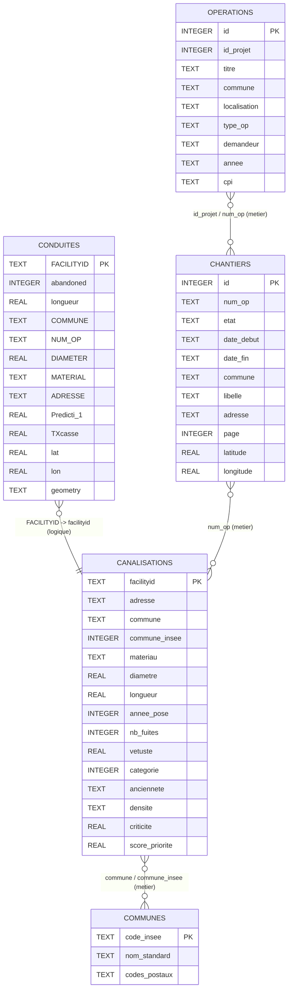

# MCD - Base `renovTaCana.db` (schema produit par le build SQLite)

Ce document decrit le **modele de donnees cible** de `database/renovTaCana.db` tel qu'il est **cree et rempli** par le script Python :

`script/database/build-sqlite/build_sqlite_database.py`

(avec `script/database/build-sqlite/geo_communes_import.py` pour `communes` et `script/database/build-sqlite/nominatim_geocode.py` pour les coordonnees chantiers.)

Un fichier `renovTaCana.db` present dans le depot sans regeneration peut **differer** de ce schema (colonnes manquantes ou donnees obsoletes) ; le script ci-dessus reste la reference.

## Vue d'ensemble

Tables metier creees par le build :

- `conduites`
- `canalisations`
- `chantiers`
- `operations`
- `communes`

(La table interne `sqlite_sequence` peut exister pour les autoincrements SQLite ; elle n'est pas modelisee ici.)

## Diagramme MCD (Mermaid)

## Notes (comportement du build)

- Les liens du diagramme sont des **relations metier** (logiques) ; aucune cle etrangere SQL n'est declaree dans le script de build.
- **`conduites`** : colonnes et types issus de la liste `CONDUITES_COLUMNS` dans `build_sqlite_database.py` (donnees shapefiles / enrichissements puis insert batch).
- **`canalisations`** : creee a partir des conduites + CSV optionnel `data/pipe_ranking_v1_clear.csv` ; indexes `idx_can_commune`, `idx_can_adresse_commune`.
- **`chantiers`** : creee avec `adresse`, `latitude` / `longitude` ; les lignes sont inserees depuis `data/chantiers.xlsx` (sans ces champs dans l'INSERT), puis **`populate_chantiers_adresse_from_libelle`** remplit `adresse` a partir du `libelle` (regex / nettoyage), puis **`populate_chantiers_geocodes`** met a jour les coordonnees **uniquement** a partir de la colonne `adresse` (plus la commune) via Nominatim et `database/geocode_cache.json`. Si `RTC_SKIP_GEOCODE` vaut `1` / `true` / `yes`, aucun appel reseau pour le geocodage. Sur une base deja existante, `ensure_chantiers_adresse_column` / `ensure_chantiers_geo_columns` peuvent ajouter des colonnes manquantes par `ALTER TABLE`.
- **`operations`** : import depuis `data/Operations.xlsx` ; index `idx_op_commune_annee`.
- **`communes`** : si `data/geo_localisation.sql` est present, table creee / videe / remplie par `import_communes_from_geo_sql` ; sinon le build cree la table vide (meme DDL) et affiche un avertissement.

### API carte et coordonnees chantiers

L'endpoint `GET /api/geojson/chantiers` lit `latitude` / `longitude` lorsque ces colonnes existent dans la table ; la propriete `adresse` est exposee si la colonne existe. Sinon il retombe sur le cache JSON et le geocodage en arriere-plan (`script/endpoints/geojson.py`).

## Colonnes des autres tables (DDL du build)

Listes alignees sur les `CREATE TABLE` (et `INSERT` implicites) de `build_sqlite_database.py` / `geo_communes_import.py`.

### `canalisations`

- `facilityid` (PK)
- `adresse`
- `commune`
- `commune_insee`
- `materiau`
- `diametre`
- `longueur`
- `annee_pose`
- `nb_fuites`
- `vetuste`
- `categorie`
- `anciennete`
- `densite`
- `criticite`
- `score_priorite`

### `chantiers`

- `id` (PK, autoincrement)
- `num_op`
- `etat`
- `date_debut`
- `date_fin`
- `commune`
- `libelle`
- `adresse` (voie extraite du libelle au build ; NULL si non extractible)
- `page`
- `latitude` (remplie au build par geocodage lorsque possible)
- `longitude` (idem)

### `communes`

- `code_insee` (PK)
- `nom_standard` (NOT NULL)
- `codes_postaux`

### `operations`

- `id` (PK)
- `id_projet`
- `titre`
- `commune`
- `localisation`
- `type_op`
- `demandeur`
- `annee`
- `cpi`

## Liste exhaustive des colonnes de `conduites`

Definies par `CONDUITES_COLUMNS` dans `build_sqlite_database.py` :

- `FACILITYID` (PK)
- `abandoned`
- `longueur`
- `COMMUNE`
- `INSEE`
- `UDI`
- `NUM_OP`
- `OBJECTID`
- `DIAMETER`
- `DIAMEXT`
- `PRECISIOND`
- `MATERIAL`
- `PRECISIONM`
- `INSTALLDAT`
- `PRECISIONI`
- `PERIODE_PO`
- `WATERTYPE`
- `DOMAINE`
- `FONCTION`
- `SENSIBILIT`
- `PRESSION`
- `OSSATURE`
- `CONTRAT`
- `ADRESSE`
- `COTE_TN`
- `PROFONDEUR`
- `JOINT`
- `EMPLACEMEN`
- `LITDEPOSE`
- `TYPE_SOL`
- `ETAT_SOL`
- `TRAFIC`
- `ENVIR_ELEC`
- `NB_BRANCHE`
- `FABRICANT`
- `TECHNIQUE_`
- `PROTECT_IN`
- `PROTECT_EX`
- `PROTECT_CA`
- `DEPOT`
- `CORROSION`
- `VALEUR_NEU`
- `TRANSMISS`
- `LASTUPDATE`
- `LASTEDITOR`
- `ENABLED`
- `ACTIVEFLAG`
- `OWNEDBY`
- `MAINTBY`
- `LONGSYS`
- `COMMENTA`
- `MAJ`
- `ETAGPRESSI`
- `IDADRESS`
- `SECTORISAT`
- `PRECISLOCA`
- `CLASSE_DIC`
- `NOMCANAUX`
- `SAISIE`
- `SYMBOLOGIE`
- `TYPE_POSE`
- `DN`
- `PROTECATHO`
- `REGULATEUR`
- `AGENCE`
- `COMMENTA_D`
- `PROSP_RENO`
- `MAJREFGEOM`
- `DATEMAJGEO`
- `CONVENTION`
- `DATEMAJH`
- `SHAPE_Leng`
- `dense`
- `ValoPat`
- `Vetuste`
- `nbFuites`
- `nbAbo`
- `sumConso`
- `PRESSIONAV`
- `DEM_EAU_LS`
- `CATEGORIE_`
- `Traffic`
- `PrioMerlin`
- `TXcasse`
- `Altimetrie`
- `Prediction`
- `Predicti_1`
- `ABANDATE`
- `HS_CAUSE`
- `CAUSECOM`
- `FACILITYKE`
- `LINETYPE`
- `lat`
- `lon`
- `geometry`
