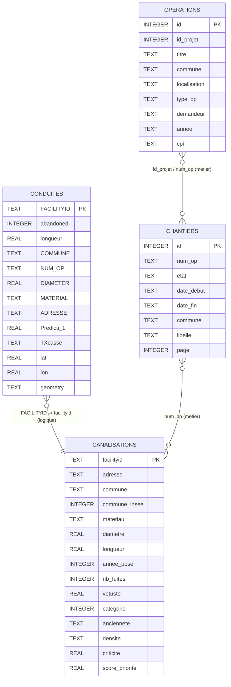

# MCD - Base `renovTaCana.db`

Ce document decrit le modele conceptuel de donnees de `database/renovTaCana.db`.

## Vue d'ensemble

Tables metier presentes :

- `conduites`
- `canalisations`
- `chantiers`
- `operations`

## Diagramme MCD (Mermaid)

## Notes

- Les liens affiches sont des **relations metier** (logiques) ; ils ne sont pas declares en cles etrangeres SQL dans la base actuelle.
- `conduites` est la table source enrichie (SIG/ETL).
- `canalisations`, `chantiers`, `operations` correspondent au schema applicatif utilise par les routes API historiques.

## Liste exhaustive des colonnes de `conduites`

- `FACILITYID` (PK)
- `abandoned`
- `longueur`
- `COMMUNE`
- `INSEE`
- `UDI`
- `NUM_OP`
- `OBJECTID`
- `DIAMETER`
- `DIAMEXT`
- `PRECISIOND`
- `MATERIAL`
- `PRECISIONM`
- `INSTALLDAT`
- `PRECISIONI`
- `PERIODE_PO`
- `WATERTYPE`
- `DOMAINE`
- `FONCTION`
- `SENSIBILIT`
- `PRESSION`
- `OSSATURE`
- `CONTRAT`
- `ADRESSE`
- `COTE_TN`
- `PROFONDEUR`
- `JOINT`
- `EMPLACEMEN`
- `LITDEPOSE`
- `TYPE_SOL`
- `ETAT_SOL`
- `TRAFIC`
- `ENVIR_ELEC`
- `NB_BRANCHE`
- `FABRICANT`
- `TECHNIQUE_`
- `PROTECT_IN`
- `PROTECT_EX`
- `PROTECT_CA`
- `DEPOT`
- `CORROSION`
- `VALEUR_NEU`
- `TRANSMISS`
- `LASTUPDATE`
- `LASTEDITOR`
- `ENABLED`
- `ACTIVEFLAG`
- `OWNEDBY`
- `MAINTBY`
- `LONGSYS`
- `COMMENTA`
- `MAJ`
- `ETAGPRESSI`
- `IDADRESS`
- `SECTORISAT`
- `PRECISLOCA`
- `CLASSE_DIC`
- `NOMCANAUX`
- `SAISIE`
- `SYMBOLOGIE`
- `TYPE_POSE`
- `DN`
- `PROTECATHO`
- `REGULATEUR`
- `AGENCE`
- `COMMENTA_D`
- `PROSP_RENO`
- `MAJREFGEOM`
- `DATEMAJGEO`
- `CONVENTION`
- `DATEMAJH`
- `SHAPE_Leng`
- `dense`
- `ValoPat`
- `Vetuste`
- `nbFuites`
- `nbAbo`
- `sumConso`
- `PRESSIONAV`
- `DEM_EAU_LS`
- `CATEGORIE_`
- `Traffic`
- `PrioMerlin`
- `TXcasse`
- `Altimetrie`
- `Prediction`
- `Predicti_1`
- `ABANDATE`
- `HS_CAUSE`
- `CAUSECOM`
- `FACILITYKE`
- `LINETYPE`
- `lat`
- `lon`
- `geometry`
