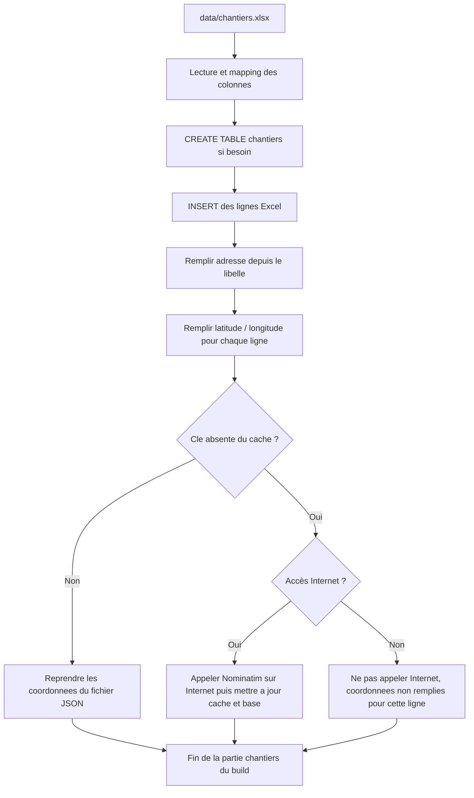

# Table `chantiers` : comment elle se remplit

Voici comment les lignes arrivent dans `chantiers` quand on construit `renovTaCana.db`, du fichier Excel jusqu’aux coordonnées sur la carte. C’est le script `script/database/build-sqlite/build_sqlite_database.py` qui enchaîne les étapes, avec l’Excel `data/chantiers.xlsx` et, pour l’adresse et le point GPS, le module `script/database/build-sqlite/nominatim_geocode.py`.

**Étape 1 — Ouvrir l’Excel.** Le build lit la première feuille de `data/chantiers.xlsx`. Il n’impose pas les mêmes titres de colonnes que dans la base : il nettoie les en-têtes et retrouve numéro d’opération, état, dates, commune, libellé, page. Une ligne du tableau = une future ligne de chantier. Sans fichier, il n’y a souvent rien à insérer.

**Étape 2 — Créer la table et enregistrer ce qui vient du tableau.** La table `chantiers` est créée si besoin. On y met tout de suite ce que l’Excel donne : numéro d’opération, état, dates, commune, libellé, page. Les colonnes `adresse`, `latitude` et `longitude` existent mais ne sont pas remplies à cette étape : elles viennent après.

**Étape 3 — Deviner la rue à partir du libellé.** Le programme relit chaque libellé. Il cherche une voie (rue, avenue, place, etc.). Quand il en trouve une, il la note dans `adresse`. Sinon `adresse` reste vide. Ça sert surtout pour l’étape suivante.

**Étape 4 — Préparer le géocodage.** Pour chaque ligne encore sans latitude/longitude, il faut une **commune** et une **adresse** (colonne déjà remplie à l’étape 3). Si l’une des deux manque, on ne géocode pas : le programme ne repart plus du libellé à cette étape.

**Étape 5 — Cache puis Nominatim sur la phrase « adresse, commune, France ».** La requête utilise **seulement** le texte stocké dans la colonne `adresse` (plus la commune). On regarde d’abord `database/geocode_cache.json` : si cette phrase y est déjà, on copie les coordonnées, sans Internet. Si elle n’y est pas : soit le build a le droit d’aller sur le réseau (variable `RTC_SKIP_GEOCODE` pas à `1` / `true` / `yes`), et alors on interroge Nominatim (OpenStreetMap), puis on met à jour la base et le fichier cache ; soit le réseau est « coupé » pour le build, et les coordonnées restent vides pour cette ligne.

**Étape 6 — Petite finition.** Un index sur la commune et l’état est ajouté pour que les filtres dans l’appli restent rapides.

## Pourquoi `database/geocode_cache.json` existe

Ce fichier n’est pas une donnée métier comme l’Excel : c’est un **cache sur disque** des réponses déjà obtenues auprès du service de géocodage (Nominatim). Tant qu’une même recherche (« rue, commune, France ») a déjà été faite, on relit le JSON au lieu de rappeler l’API. Ça raccourcit les builds et évite des appels réseau inutiles, tout en restant correct vis-à-vis du serveur public.

Le revers est connu : une entrée **fausse** dans le cache (par exemple une bonne paire latitude / longitude pour une mauvaise interprétation de l’adresse) sera réutilisée tant qu’elle reste dans le fichier, donc des **faux positifs** sont possibles. Il faut donc garder en tête que ce cache peut figer une erreur ; ce document ne liste pas de corrections à faire à la main sur le fichier, mais il vaut mieux en être conscient quand un point sur la carte « ne colle pas ».

## Schéma (même histoire, en image)

Sur le schéma, « clé absente du cache » veut dire : la phrase « rue, commune, France » n’est pas encore dans `geocode_cache.json`. « Accès Internet : non », c’est quand `RTC_SKIP_GEOCODE` bloque les appels ; « oui », c’est quand Nominatim peut être utilisé.

## Après le build

La carte et l’API utilisent surtout les `latitude` / `longitude` déjà en base quand elles sont là. La colonne `adresse` peut aussi être renvoyée par l’API en plus du libellé complet.
